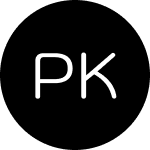

 

  

<h3 align="center">react-vscode-portfolio</h3>

  

    vscode inspired portfolio project
     
    <a href="https://parsas.studio/">parsas.studio</a>
  

### Built With

* [React.js](https://reactjs.org/)
* [Material UI](https://github.com/mui/material-ui)
* [react-markdown](https://github.com/remarkjs/react-markdown)

### Features

- Powered by markdown
- Dark mode and light mode available
- Closable tabs
- Collapsible explorer
- Responsive web design

### TODO

- Accessible web design
- Animations
- Change Fonts from MUI default

<!-- ACKNOWLEDGMENTS -->
### References/Other
* [GitHub Pages](https://pages.github.com)
* [React Icons](https://react-icons.github.io/react-icons/search)
* [Vercel Hosting](https://vercel.com/)
* [caglarturali.github.io](https://github.com/caglarturali/caglarturali.github.io)
